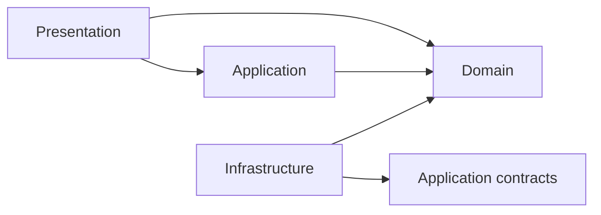
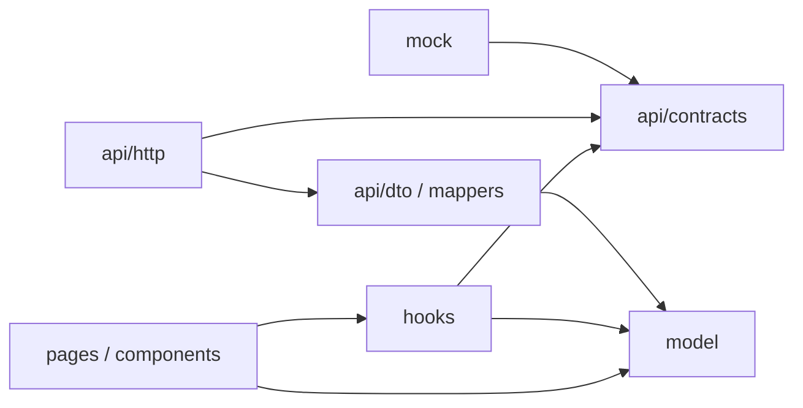

# ARCHITECTURE.md — recwatch

## 概要

`recwatch`はReact Router v7で構成するSPAである。4層で責務を分け、機能ごとのコードは`app/features/`にまとめる。

## 4層と依存方向

```text
Presentation → Application → Domain
Infrastructure → Applicationのcontracts
Infrastructure → Domain
```



- Domainは他の層に依存しない。
- PresentationはApplicationとDomainを利用できる。
- ApplicationはDomainとcontracts（交換可能な境界）に依存する。
- Infrastructureはcontractsを実装し、必要に応じてDomainを利用する。

## 配置

### Feature内

一つのFeatureだけで使うコードは`app/features/<feature>/`に置く。
Feature内では、4層を責務が見えるdirectoryへ具体化する。
以下は標準形であり、外部API、モック、画面数などFeatureの要件に応じて必要なdirectoryだけを作る。

```text
app/features/<feature>/
├─ api/
│  ├─ contracts/  # Applicationが依存する交換可能なAPI契約
│  ├─ http/       # 本番HTTP adapter
│  ├─ dto/        # 外部APIのrequest/response型
│  └─ mappers/    # DTOとmodelの境界変換
├─ mock/          # contractsを実装する開発・テスト用adapter
├─ hooks/         # Featureの状態と操作を調整するApplication logic
├─ model/         # 型、検証、業務ルールなどのDomain logic
├─ components/    # Feature内で再利用するPresentation component
├─ pages/         # Routeから呼ばれる画面単位のPresentation
└─ test/          # Featureのテスト
```

既存のdirectoryに当てはまらない場合は、所属する層を明確にしてFeature内に追加できる。

#### Feature内の依存方向

以下は依存境界を守るための原則であり、directory名や分割方法はFeatureの規模に応じて調整する。

```text
pages/components → hooks → api/contracts
       ↓             ↓          ↑
     model         model   api/http または mock
                              ↓
                         api/dto/mappers → model
```



- `pages`と`components`は原則として`api/http`、`api/dto`を直接参照せず、境界には`api/contracts`を使う。
- `hooks`は具体的なHTTP実装ではなく`api/contracts`へ依存する。
- HTTP adapterはRouteまたは依存関係の組み立て箇所で選択し、必要な場合はmock adapterと差し替えられるようにする。
- `api/dto`の外部形式（`snake_case`など）は`api/mappers`内に閉じ込める。
- 外部API固有のquery、update、page、error型は`api/contracts`に置き、Domainの型を`model`に置く。
- mockを用意する場合は、本番APIと同じ`api/contracts`を実装する。
- Component内だけの状態はComponentが持ち、複数Componentにまたがる状態や操作の調整は`hooks`に置く。純粋な業務ルールは`model`に置く。
- API errorの表示文言やUI表示ラベルはPresentation側で扱い、`model`へ持ち込まない。
- `components/`内の`list/`や`form/`などの分割は、画面上の役割が明確になる場合に採用する。
- 共通UIは`app/components/ui/`に置く。Feature固有のUI構成やdirectory名は、責務が明確ならFeatureに合わせて決める。

#### 通知Featureでの適用例

通知Featureでは、標準構成を次のように具体化している。

```text
app/features/notifications/
├─ api/
│  ├─ contracts/
│  │  └─ errors/
│  ├─ http/
│  ├─ dto/
│  └─ mappers/
├─ mock/
├─ hooks/
│  ├─ useNotificationList.ts
│  ├─ useNotificationCreate.ts
│  └─ useNotificationEdit.ts
├─ model/
│  ├─ notification.ts
│  ├─ notification-audience.ts
│  ├─ notification-draft.ts
│  ├─ notification-draft-validation.ts
│  └─ notification-list.ts
├─ components/
│  ├─ list/
│  ├─ form/
│  └─ preview/
├─ pages/
└─ test/
```

### Feature外

Feature外にはRouteの境界、複数Featureで使うコード、技術的な共通処理だけを置く。

| Path              | 配置するもの                                        |
| ----------------- | --------------------------------------------------- |
| `app/routes.ts`   | URLとRoute moduleの登録                             |
| `app/routes/`     | `clientLoader`、`clientAction`、meta、ErrorBoundary |
| `app/components/` | 複数Featureで使うcomponent                          |
| `app/hooks/`      | 複数Featureで使うhook                               |
| `app/config/`     | Routeや公開環境設定                                 |
| `app/lib/`        | 技術的な共通処理                                    |
| `app/types/`      | 複数Featureで使う型                                 |
| `public/`         | 静的asset                                           |

## 共通ルール

- 必要なdirectoryだけ作る。
- アプリケーションコード間のimportは原則`~/`aliasを使う（生成型・同一ディレクトリの相対importは除く）。
- 1fileに1つの責務を持たせる。
- Feature間で内部fileを直接参照しない。
- 循環依存を作らない。
- Secret、DB client、Node.js専用APIを含めない。
- 公開できない値を`VITE_`環境変数へ設定しない。

## 各層のルール

### Presentation

- Route moduleは`clientLoader`、`clientAction`、meta、ErrorBoundary、Pageの呼び出しに限定する。
- Path、search params、`clientLoader`のデータはRouteが持つ。
- Pageとcomponentには画面の表示と入力処理を書く。
- Component内だけの状態はComponentが持つ。
- ボーダー色は`--color-border-base`に対応する`border-border-base`などのTailwind utilityを使う。
- 業務ルールと外部I/Oは書かない。

### Application

- 一つの操作や状態は`hooks/`に置く。
- 複数処理の調整もFeatureの`hooks/`に閉じ込める。
- 複数Componentにまたがる状態はHookが持つ。
- JSXと外部response型は書かない。

### Domain

- 型、純粋な検証、業務ルールは`model/`に置く。
- React、React Router、外部APIに依存しない。
- 外部データの`snake_case`は書かない。

### Infrastructure

- Applicationとの境界契約は`api/contracts/`、HTTP実装は`api/http/`に置く。
- 外部APIのrequest/response型は`api/dto/`、境界変換は`api/mappers/`に置く。
- 開発・テスト用adapterは`mock/`に置く。
- ResponseはDomainの型へ変換して返す。
- 共通のHTTP処理は`app/lib/api-client.ts`を使う。
- UI状態、業務ルール、複数処理の調整は書かない。
